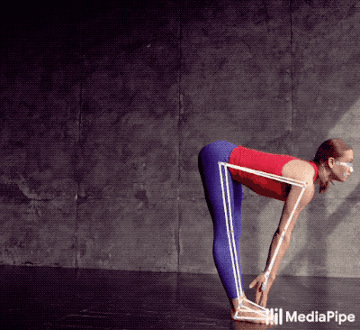

# Pose-Estimation

#### 3D pose estimation is a process of predicting the transformation of an object from a user-defined reference pose, given an image or a 3D scan.

---



---

* Clone this repository in your local environment by running the code on your bash.

* `git clone https://github.com/YOUR-USERNAME/Pose-Estimation.git`

Now, install the required **packages**:

* `pip install opencv-python`

OpenCV is a library of programming functions mainly aimed at real-time computer vision. Originally developed by Intel, it was later supported by Willow Garage then Itseez. The library is cross-platform and free for use under the open-source Apache 2 License.

Usage:

* To access your webcam through opencv

```python
import cv2

cap = cv2.VideoCapture(0)

while True:
    success, vid = cap.read()
    cv2.imshow("Video", vid)
    cv2.waitKey(1)
```
